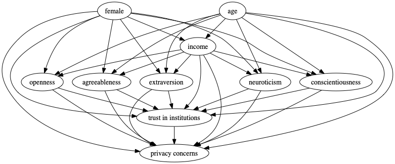

# What Factors Determine Digital Privacy Concerns?
This repository contains the underlying code for my analysis that I shared on [medium](https://medium.com/@keremtuberkapraz/what-factors-determine-digital-privacy-concerns-6f6d7211b7a0).

## Contents of this Repository
1) [The jupyter notebook](https://github.com/tugberkcapraz/pi_concerns/blob/main/Post.ipynb) contains the code and
explanations of my design choices. 
2) [Europinions.pdf](https://github.com/tugberkcapraz/pi_concerns/blob/main/europinions.pdf) is the file that you can 
find the survey report and the questionnaire that I used in this project.
3) [plots](https://github.com/tugberkcapraz/pi_concerns/tree/main/plots) is the directory for the plots
4) [sem_report](https://github.com/tugberkcapraz/pi_concerns/tree/main/sem_report) is the report that is automatically
created by semopy package. 
5) [functions](https://github.com/tugberkcapraz/pi_concerns/tree/main/functions) contains the helper functions that used 
in the analysis.

## Research Questions
There are three questions that I wanted to answer in this study

1. Do **personality traits** impact digital privacy concerns?

2. Does **trust in political institutions** have any impact on digital privacy concerns?

3. Do **demographics** impact digital privacy concerns?

## Data

Data is available [GESIS](https://search.gesis.org/research_data/ZA5553) archive. The access to the data is free
of charge for members. You can get free membership and download the data

## Methodology
I used 3 different frameworks. 

1. Structural Equation Modelling
2. Multivariate Regression Modelling
3. Causal Inference via Directed Acyclic Graphs

Causal inference was my final goal, however I wanted to build the first two models for comparison purposes. 

The following packages are used in this analysis:
> #### pre-processing:
> > *pandas*
> 
> #### plotting
> 
> > *matplotlib, plotnine*
> 
> #### modelling:
> > *Semopy, Statsmodels, DoWhy* 

## Results
My Provisional causal model indicate that:
>#### Question 1:
>>**Neither of personality traits** have significant impact on the target.
>#### Question 2:
>>**trust in institutions**  have **negative** impact on digital privacy concerns.
>#### Question 3:
>> Among demographics, **Income** has negative impact, wheras **age** has the contrary. **Gender** has no impact on the 
> matter
